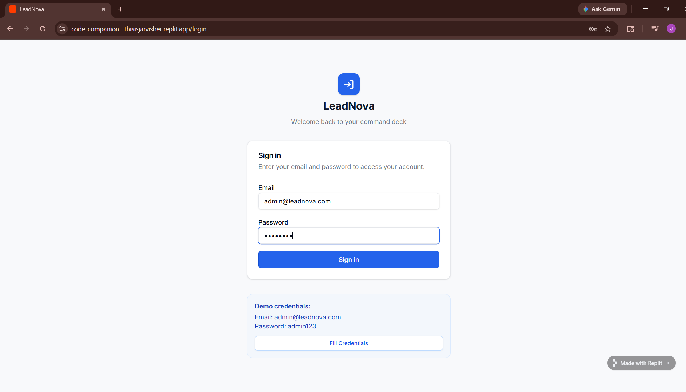
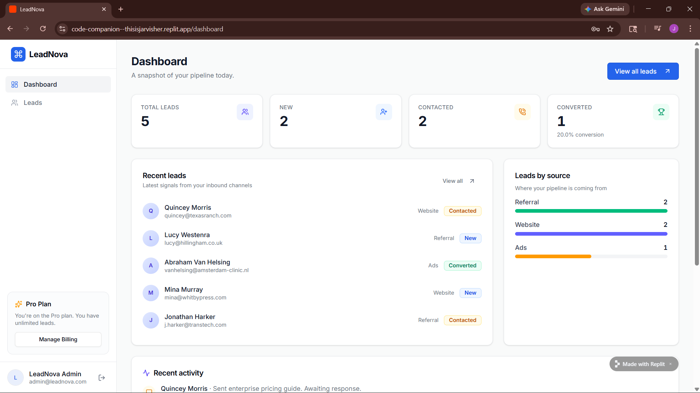
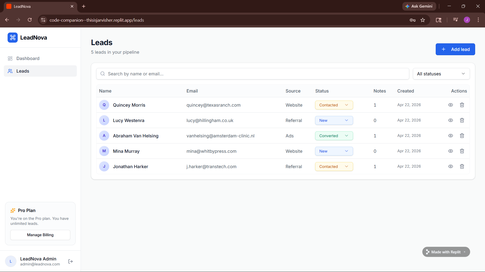
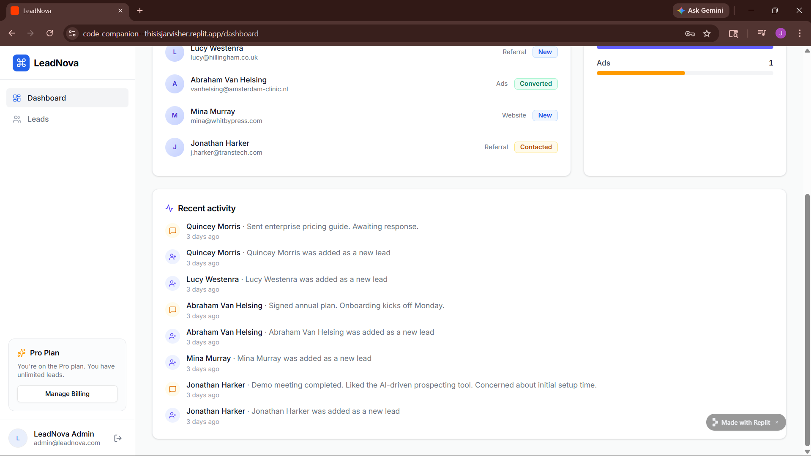

# LeadNova – Client Lead Management System (Mini CRM)

## Full Stack Web Development Internship  
### Task 2 – Production-Ready MERN CRM

---

## Overview

LeadNova is a production-quality full-stack MERN application built to simulate how real businesses manage incoming leads from websites.

It provides a centralized system to capture, track, update, and convert leads, along with follow-up management — replicating real-world CRM workflows used by agencies and startups.

This project is designed with scalability, clean architecture, and professional UI/UX, making it suitable for real business use.

---

## Objective

The goal of LeadNova is to build a system that:

- Captures leads from contact forms  
- Stores and manages data in MongoDB Atlas  
- Tracks lead status (New → Contacted → Converted)  
- Enables follow-up tracking via notes  
- Provides a secure admin dashboard  
- Demonstrates real-world full-stack development  

---

## Tech Stack

### Frontend
- React.js  
- Tailwind CSS  
- Axios  

### Backend
- Node.js  
- Express.js  

### Database
- MongoDB Atlas  
- Mongoose  

### Authentication
- JWT (JSON Web Token)  
- bcrypt.js  

---

## Architecture (Single Server – Replit Ready)

Unlike typical MERN apps, LeadNova runs on a single Express server:

- React frontend is built and served as static files  
- Backend APIs run on the same server  
- No multiple ports required  
- Fully compatible with Replit deployment  

---

## Core Features

### Authentication System
- Secure admin login  
- Password hashing using bcrypt  
- JWT-based session handling  
- Protected API routes  

---

### Admin Dashboard
- Clean SaaS-style UI  
- Fully responsive layout  
- Smooth and fast interactions  
- Real-time lead updates  

---

### Lead Management
- Create new leads  
- View all leads in a structured table  
- Update lead status:
  - New  
  - Contacted  
  - Converted  

---

### Notes & Follow-ups
- Add multiple notes per lead  
- Timestamp tracking  
- Helps simulate real client communication  

---

### Search & Filter
- Search leads by name/email  
- Filter by status  
- Instant UI updates  

---

### Analytics
- Total leads  
- Contacted leads  
- Converted leads  
- Conversion rate (%)  

---

### Lead Actions
- Update lead status  
- Delete leads with confirmation  

---

## System Workflow

1. User submits contact form  
2. Data is sent to backend API  
3. Lead is stored in MongoDB Atlas  
4. Admin logs into dashboard  
5. Admin manages leads (status + notes)  
6. Leads move through conversion pipeline  

---

## Project Structure

/leadnova

│

├── /server

├── /client-build

├── /config

├── /models

├── /controllers

├── /routes

├── /middleware

├── server.js

---

## API Endpoints

### Auth
- POST /api/auth/login  

### Leads
- POST /api/leads  
- GET /api/leads  
- PUT /api/leads/:id  
- POST /api/leads/:id/notes  
- DELETE /api/leads/:id  

---

## Environment Variables

Create a `.env` file:

MONGO_URI=your_mongodb_atlas_connection_string
JWT_SECRET=your_secret_key

---

## Setup & Run

npm install

node server.js

Open in browser:
http://localhost:5000

---

## Default Admin Login

Email: admin@leadnova.com

Password: admin123

---

## Key Learning Outcomes

-Built a full-stack MERN application

-Implemented secure authentication using JWT

-Designed RESTful APIs

-Managed real-world data using MongoDB Atlas

-Created a production-style dashboard

-Understood real business workflows

---

## Live Demo

https://code-companion--thisisjarvisher.replit.app/

---

## Repository

https://github.com/AkshayaKrishnan18/FUTURE_FS_02

---

## Preview

---

## Contact

Email: akshayakrishnan1810@gmail.com

GitHub: https://github.com/AkshayaKrishnan18

LinkedIn: https://linkedin.com/in/akshaya-krishnan-98722b294
